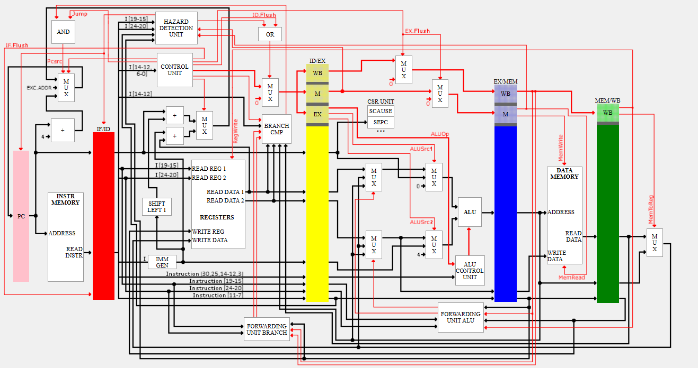

# RV32I Pipelined RISC-V CPU with Web Simulator

🔗 Live Application:
https://risc-v-server-1.onrender.com/

## Overview
This project implements a 32-bit RV32I pipelined RISC-V processor written in Verilog, together with a web-based simulator that allows users to write assembly code, assemble it into machine code, and execute it on the processor using Verilog simulation.

The processor includes forwarding, hazard detection, pipeline registers, and branch handling logic, similar to a real CPU pipeline.

## Features
### Processor Architecture
- 32-bit RV32I instruction set subset
- 5-stage pipeline architecture (IF, ID, EX, MEM, WB)
- Implemented in Verilog HDL

### Supported Instructions
- R-type: add, and, or
- I-type: addi, lw
- S-type: sw
- B-type: beq

### Pipeline Hazard Handling

The processor includes hardware mechanisms to handle common pipeline hazards.

- Data hazards are resolved using a forwarding unit that selects values from MEM and WB stages when the register file does not yet contain the correct value.

- Load-use hazards are detected in the Hazard Detection Unit, which inserts a stall and flush to prevent incorrect execution.

- Control hazards are resolved by computing the branch decision in the Execute stage and flushing the pipeline when needed.

## Project Components

- Verilog CPU

- Python Assembler
  - Converts RISC-V assembly to machine code
  - Supports labels and offsets
  - Generates program.mem

- Web Interface (Flask)
  - Accepts assembly code
  - Runs assembler
  - Compiles Verilog using Icarus Verilog
  - Runs simulation
  - Displays output

- Docker Container
  - Includes Python + Icarus Verilog
  - Allows running the simulator online

## Simulation Flow

1. User writes assembly code in the web interface
2. Python assembler converts code to machine code
3. program.mem is generated
4. Verilog files are compiled using Icarus Verilog
5. Testbench runs the CPU
6. Output is displayed in the browser